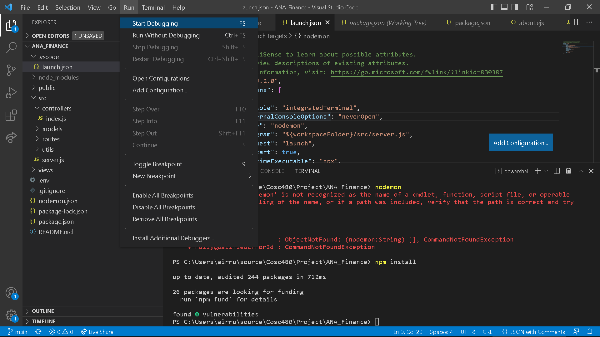

# ANA_Finance
## Local Setup Guide:
1. Clone the repo
2. Make sure nodejs and npm are installed
3. cd to the ANA_Finance folder
4. npm install in that folder
5. open the folder in vscode
6. click run -> start debugging or without debugging
7. open a browser -> navigate to localhost:4300

